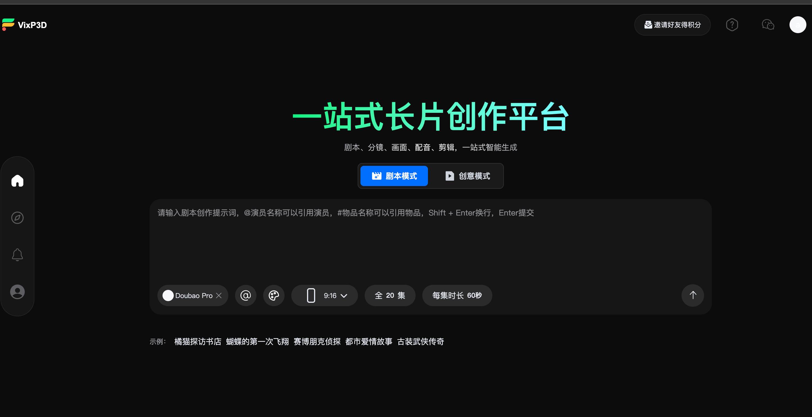
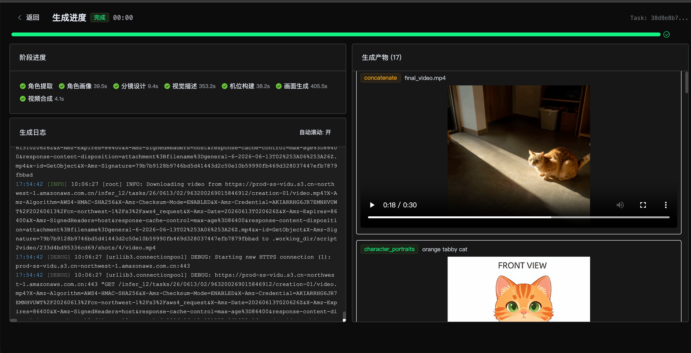
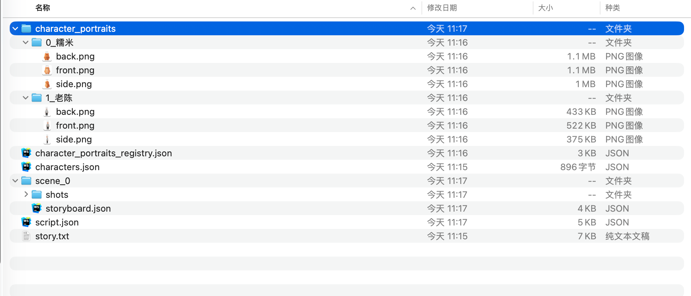

<div align="center">

# AIMovie

### AI 驱动的智能视频生成平台

**从创意到视频，一站式智能创作**

[](https://www.python.org/)
[](https://nodejs.org/)
[](https://vuejs.org/)
[](https://fastapi.tiangolo.com/)
[](LICENSE)
[](https://docs.astral.sh/uv/)

</div>

---

## 简介

AIMovie 是一个开源的 AI 视频生成平台，提供从创意构思到成片视频的端到端智能创作能力。平台支持两种核心创作模式：

- **连续剧模式**：输入创意提示词，AI 自动生成完整剧本、分镜设计、角色外观，并逐场景生成视频片段，最终合成完整长视频。
- **单片模式**：上传参考图片 + 提示词，快速生成单段视频，适合短视频创作和素材制作。

整个流程涵盖 **剧本生成 → 分镜设计 → 角色外观 → 图片生成 → 视频合成** 全链路，让你专注于讲故事，把技术实现交给 AI。

## 演示视频

https://github.com/user-attachments/assets/example_generate_video

> 点击上方播放完整演示，或下载查看：[example_generate_video.mp4](doc/example_generate_video.mp4)

## 界面展示

### 首页

支持连续剧模式和单片模式两种创作入口，输入提示词即可开始创作。

<p align="center">
  
</p>

### 创作进度

实时展示剧本生成、分镜设计、图片生成、视频合成等各阶段的进度。

<p align="center">
  
</p>

### 角色一致性

同一角色在不同场景和镜头中保持外观一致，由同一个模型统一生成。

<p align="center">
  
</p>

## 核心特性

| 特性 | 说明 |
|------|------|
| 一站式创作 | 从创意到成片，剧本、分镜、画面、配音、剪辑全流程自动化 |
| 多模型支持 | 集成 Seedream、Nanobanana、Hunyuan、Seedance、Veo 等多种 AI 模型 |
| 角色一致性 | 智能参考图管理，确保角色在不同场景中外观统一 |
| 实时进度 | SSE 实时推送任务进度，随时掌握生成状态 |
| 灵活配置 | 支持多种 AI 服务商，按需切换模型 |
| 一键启动 | 提供 Windows / Linux / macOS 一键启动脚本 |

## 项目结构

```
AIMovie/
├── backend/              # Python FastAPI 后端
│   ├── main.py           # API 入口
│   ├── auth.py           # 账号密码登录
│   ├── tools/            # 图片/视频生成器 (Seedream, Nanobanana, Hunyuan 等)
│   ├── pipelines/        # 视频生成流水线 (Idea2Video, Script2Video)
│   └── configs/          # YAML 配置文件
├── frontend/             # Vue 3 + Vite 前端
│   └── src/
│       ├── views/        # 页面组件
│       ├── components/   # 通用组件
│       └── locale/       # 国际化
├── doc/                  # 项目文档与截图
│   ├── api.md            # API 接口文档
│   ├── 数据库.md          # 数据库设计
│   ├── 生成视频架构.md     # 视频生成架构
│   └── 花屏问题.md        # 常见问题排查
├── start.sh              # Linux / macOS 一键启动
├── start.bat             # Windows 一键启动（双击运行）
├── start.ps1             # Windows 启动脚本（由 start.bat 调用）
└── README.md
```

## 环境要求

| 依赖 | 版本 | 说明 |
|------|------|------|
| Python | >= 3.12 | 后端运行时 |
| Node.js | >= 18 | 前端构建 |
| [uv](https://docs.astral.sh/uv/getting-started/installation/) | 最新 | Python 包管理器 |

## 快速开始

### 1. 克隆项目

```bash
git clone https://github.com/your-org/AIMovie.git
cd AIMovie
```

### 2. 安装依赖

```bash
# 后端
cd backend
uv sync

# 前端
cd ../frontend
npm install
```

### 3. 配置环境变量

```bash
cp backend/env_example backend/.env
```

编辑 `backend/.env`，填入你的 API Key（只需配置你打算使用的服务商）：

```env
# 豆包/火山引擎（推荐国内用户）
ARK_API_KEY=your_ark_api_key

# Google Gemini（图片 Nanobanana / 视频 Veo）
GOOGLE_API_KEY=your_google_api_key

# 腾讯混元
HUNYUAN_API_KEY=your_hunyuan_api_key

# MiniMax
MINIMAX_API_KEY=your_minimax_api_key

# OpenAI
OPENAI_API_KEY=your_openai_api_key
```

### 4. 启动

**方式一：一键启动（推荐）**

| 系统 | 命令 |
|------|------|
| **Windows** | 双击 `start.bat`，或在项目根目录执行 `.\start.bat` |
| **Linux / macOS** | `./start.sh` |

启动脚本会自动完成依赖同步、后端启动、前端启动，日志输出到 `backend.log` 和 `backend.err.log`。

**方式二：分别启动**

```bash
# 终端 1 - 启动后端
cd backend && uv run python main.py

# 终端 2 - 启动前端
cd frontend
npm run dev
```

### 5. 访问

| 服务 | 地址 |
|------|------|
| 前端界面 | http://localhost:36310/aimovie/ |
| 后端 API 文档 | http://localhost:8666/docs |
| 健康检查 | http://localhost:8666/health |

## 支持的 AI 模型

### 图片生成

| 模型 | 服务商 | 说明 |
|------|--------|------|
| Seedream 4.0 | 火山引擎（豆包） | 文生图 |
| Nanobanana | Google Gemini | 图片生成 |
| Hunyuan | 腾讯混元 | hy-image-v3.0 |

### 视频生成

| 模型 | 服务商 | 说明 |
|------|--------|------|
| Seedance 1.5 Pro | 火山引擎（豆包） | 图生视频 |
| Veo 3 | Google | 视频生成 |

### 大语言模型

用于剧本生成、分镜设计、创意扩展等文本理解任务，支持 OpenAI 兼容接口的任意模型。

## 核心 API

| Method | Path | 说明 |
|--------|------|------|
| POST | `/api/script2video` | 剧本 → 视频 |
| POST | `/api/idea2video` | 创意 → 视频 |
| POST | `/app/shortplay/api/Index/submit` | 提交生成任务 |
| GET | `/api/tasks/{task_id}` | 查询任务状态 |
| GET | `/api/tasks/{task_id}/stream` | 任务进度 SSE 推送 |
| GET | `/api/models` | 获取可用模型列表 |
| GET | `/api/styles` | 获取风格列表 |
| POST | `/app/user/api/Login/register` | 账号注册 |
| POST | `/app/user/api/Login/login` | 账号登录 |

完整 API 文档请参阅 [doc/api.md](doc/api.md)，启动后也可访问 http://localhost:8666/docs 查看 Swagger 文档。

## 登录说明

当前支持**账号密码**注册与登录。首次使用请点击右上角「登录」→「注册」创建账号。

## 更多文档

- [API 接口文档](doc/api.md) — 完整的后端 API 接口说明
- [视频生成架构](doc/生成视频架构.md) — Idea2Video 长视频生成逻辑分析
- [数据库设计](doc/数据库.md) — 数据模型与表结构
- [花屏问题排查](doc/花屏问题.md) — 常见视频花屏问题与解决方案

## 技术栈

**后端**：Python 3.12 / FastAPI / SQLAlchemy / LangChain / uv

**前端**：Vue 3 / Vite / Vue Router / vue-i18n / Element Plus

**AI 服务**：火山引擎（豆包）/ Google Gemini / 腾讯混元 / MiniMax / OpenAI

## 参与贡献

欢迎提交 Issue 和 Pull Request！在提交 PR 之前，请确保：

1. 代码风格与现有代码保持一致
2. 新功能附带相应的测试
3. 提交信息清晰描述改动内容

## 许可证

本项目基于 MIT 许可证开源 — 详见 [LICENSE](LICENSE) 文件。

## Star History

如果这个项目对你有帮助，请给一颗 Star 支持！
